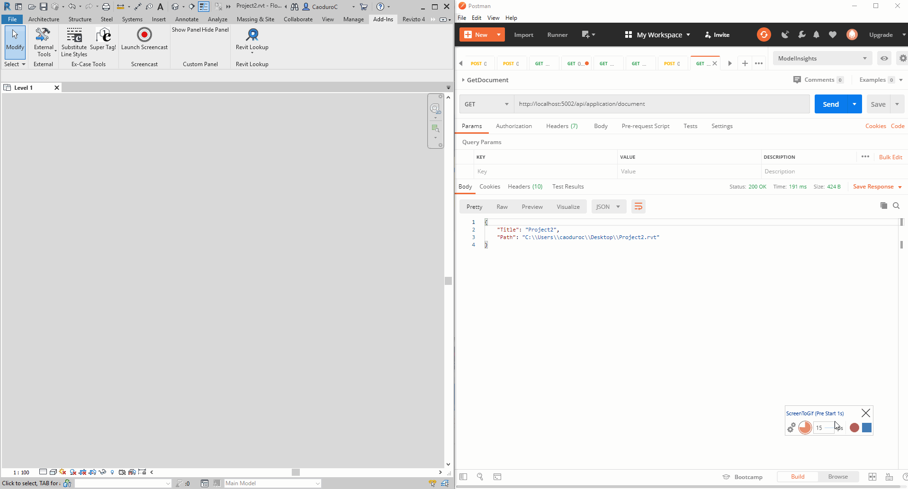

# Revit Micro Server

Let's give to Revit the ability to act as a REST server creating end points in the application context.



Still in the very early stages so...feel free to <strong>contribute</strong> with the usual pull process!

## Architecture
The application uses [EmbedIO](https://github.com/unosquare/embedio) to start a tiny server that can answer to rest calls.

### How to

Create a server in the [Utils.cs](RevitMicroServer/Utils/Utils.cs)

```csharp
public WebServer CreateWebServer(ExternalCommandData commandData)
{
    var url = string.Format("{0}:{1}", Settings.Default.BASEURL, Settings.Default.PORT);
    var server = new WebServer(o => o
            .WithUrlPrefix(url)
            .WithMode(HttpListenerMode.Microsoft))
        // First, we will configure our web server by adding Modules.
        .WithLocalSessionManager()
        .WithWebApi("/api", m => m
            .RegisterController(() => new ApplicationController(commandData.Application))
        )
        .WithModule(new ActionModule("/", HttpVerbs.Any, ctx => ctx.SendDataAsync(new { Message = "Error" })));
    // Listen for state changes.
    server.StateChanged += (s, e) => $"WebServer New State - {e.NewState}".Info();

    return server;
```

Define new controllers [ApplicationController.cs](RevitMicroServer/Controllers/ApplicationController.cs)

```csharp
public sealed class ApplicationController : WebApiController
{
    public ApplicationController(UIApplication application)
    {
        Application = application;
    }

    public UIApplication Application { get; }

    [Route(HttpVerbs.Get, "/application/document")]
    public Document GetActiveDocument()
    {
        return new Document
        {
            Title = Application.ActiveUIDocument.Document.Title,
            Path = Application.ActiveUIDocument.Document.PathName
        };
    }
}
```

And additional DTOs if needed in the <em>Domain</em> project

```csharp
public class Document
{
    public string Title { get; set; }
    public string Path { get; set; }
}
```

## To do list

- [ ] Add Stop server command
- [ ] Add front end project
- [ ] Implement push button start an Electron application 
- [ ] Add more controllers
- [ ] A lot more...

